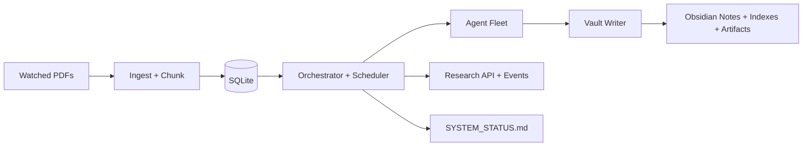

# Information Lab

Information Lab is an edge-native autonomous pipeline that converts PDFs into an Obsidian-ready knowledge graph and continuously runs multi-agent research over the generated notes.

## What it does

- Watches a folder for newly dropped PDFs.
- Ingests/chunks content into SQLite (WAL) with durable task state.
- Runs extraction + formula lanes on a light model tier.
- Runs curator/bridge/theorem/derivation/report lanes on a heavy model tier.
- Writes structured notes and generated artifacts into an Obsidian-friendly vault.
- Exposes ad-hoc research request APIs and timeline reads.
- Generates `SYSTEM_STATUS.md` for built-in operational monitoring.

## Quick start

```bash
cargo run
```

Then drop PDFs into your configured `WATCH_DIR` and inspect output in `VAULT_DIR`.

## Runtime feature set

### Ingest and extraction

- Debounced filesystem watcher.
- Duplicate suppression by document hash.
- Chunk-batch extraction pipeline.
- Error retrier with bounded retries/backoff.

### Research lanes

- Topic curation from index deltas.
- Cross-source bridge proposal/refinement loop.
- Confidence-gated theorem generation.
- Formula-seeded derivation chain generation.
- Daily report generation.
- API-triggered ad-hoc research (`Research` tasks) with solvability gate.

### Formula features

- Math-density detection for targeted formula extraction.
- Formula normalization + harvested vault index (`Formulas.md`).

### Monitoring and observability

- `SYSTEM_STATUS.md` with queue depth, per-role usage, doc progress, and recent events.
- Research timeline API:
  - `POST /research/request`
  - `GET /research/{id}`
  - `GET /research/{id}/events`
- Optional OTLP tracing via `OTEL_EXPORTER_OTLP_ENDPOINT`.

## High-level architecture



## Documentation

- [Docs Home](docs/README.md)
- [User Guide](docs/user-guide/README.md)
- [Developer Guide](docs/developer-guide/README.md)
- [Architecture](docs/architecture/README.md)
- [Research Loop](docs/research-loop/README.md)

## Repository layout

- `src/` core runtime and agents
- `skills/` prompt and behavior specs
- `migrations/` SQLite schema evolution
- `systemd/` service unit
- `docs/` user/developer/architecture documentation

## Contributing

If you add a new agent or runtime behavior, update the relevant docs in the same PR:

- `docs/user-guide/README.md` (operator-facing behavior)
- `docs/developer-guide/README.md` (implementation/extension guidance)
- `docs/architecture/README.md` (topology/control-flow changes)
- `docs/research-loop/README.md` (research lifecycle/state changes)
