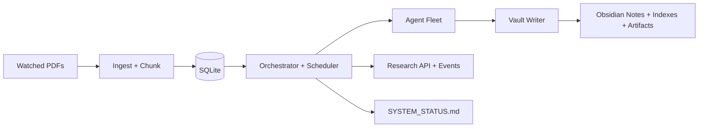

# Information Lab

Information Lab is an edge-native autonomous pipeline that converts PDFs into an Obsidian-ready knowledge graph and continuously runs multi-agent research over the generated notes.

## What it does

- Watches a folder for newly dropped PDFs.
- Ingests/chunks content into SQLite (WAL) with durable task state.
- Runs extraction + formula lanes on a light model tier.
- Runs curator/bridge/theorem/derivation/report lanes on a heavy model tier.
- Writes structured notes and generated artifacts into an Obsidian-friendly vault.
- Exposes ad-hoc research request APIs and timeline reads.
- Generates `SYSTEM_STATUS.md` for built-in operational monitoring.

## Quick start

### 5-minute quick start

1. **Prerequisites**
   - Rust toolchain installed (`rustup`, `cargo`, and a current stable compiler).
   - SQLite available on your system (the pipeline uses SQLite with WAL mode).
   - Optional: [Obsidian](https://obsidian.md/) for browsing the generated vault notes.

2. **Configure environment**

   Set the minimum required runtime directories before starting the service:

   ```bash
   export WATCH_DIR=/absolute/path/to/incoming-pdfs
   export VAULT_DIR=/absolute/path/to/obsidian-vault
   ```

   `WATCH_DIR` is where you drop source PDFs. `VAULT_DIR` is where notes/artifacts are written.

3. **Start the pipeline**

   ```bash
   cargo run
   # or
   cargo run --release
   ```

4. **Try it now**
   - Create an input directory if it does not exist and ensure `WATCH_DIR` points to it.
   - Place one sample PDF inside `WATCH_DIR`.
   - Wait for processing, then inspect `VAULT_DIR` for generated notes and artifacts.

5. **Verify pipeline is running**
   - Confirm notes/artifacts appear in your vault (`VAULT_DIR`).
   - Confirm `SYSTEM_STATUS.md` is created and updates over time.
   - Optionally verify research endpoints:
     - `POST /research/request`
     - `GET /research/{id}`
     - `GET /research/{id}/events`

### Troubleshooting (first run)

| Symptom | Likely cause | What to do |
| --- | --- | --- |
| App exits on startup with config errors | Missing required env vars | Set `WATCH_DIR` and `VAULT_DIR`, then restart `cargo run`. |
| Pipeline starts but nothing happens | `WATCH_DIR` is empty or wrong path | Verify path exists, drop a PDF into `WATCH_DIR`, and watch logs. |
| No notes/artifacts in vault | `VAULT_DIR` is incorrect/unwritable or processing failed | Check `VAULT_DIR` path/permissions and inspect logs + `SYSTEM_STATUS.md`. |

## Runtime feature set

### Ingest and extraction

- Debounced filesystem watcher.
- Duplicate suppression by document hash.
- Chunk-batch extraction pipeline.
- Error retrier with bounded retries/backoff.

### Research lanes

- Topic curation from index deltas.
- Cross-source bridge proposal/refinement loop.
- Confidence-gated theorem generation.
- Formula-seeded derivation chain generation.
- Daily report generation.
- API-triggered ad-hoc research (`Research` tasks) with solvability gate.

### Formula features

- Math-density detection for targeted formula extraction.
- Formula normalization + harvested vault index (`Formulas.md`).

### Monitoring and observability

- `SYSTEM_STATUS.md` with queue depth, per-role usage, doc progress, and recent events.
- Research timeline API:
  - `POST /research/request`
  - `GET /research/{id}`
  - `GET /research/{id}/events`
- Optional OTLP tracing via `OTEL_EXPORTER_OTLP_ENDPOINT`.

## High-level architecture



## Documentation

- [Docs Home](docs/README.md)
- [User Guide](docs/user-guide/README.md)
- [Developer Guide](docs/developer-guide/README.md)
- [Architecture](docs/architecture/README.md)
- [Research Loop](docs/research-loop/README.md)

## Repository layout

- `src/` core runtime and agents
- `skills/` prompt and behavior specs
- `migrations/` SQLite schema evolution
- `systemd/` service unit
- `docs/` user/developer/architecture documentation

## Contributing

If you add a new agent or runtime behavior, update the relevant docs in the same PR:

- `docs/user-guide/README.md` (operator-facing behavior)
- `docs/developer-guide/README.md` (implementation/extension guidance)
- `docs/architecture/README.md` (topology/control-flow changes)
- `docs/research-loop/README.md` (research lifecycle/state changes)
