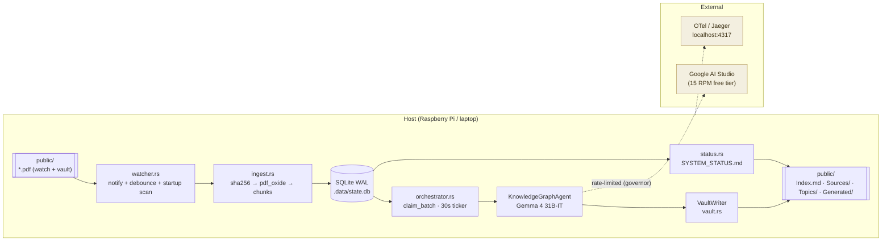
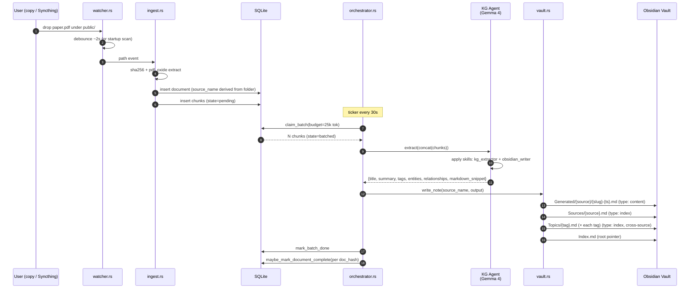
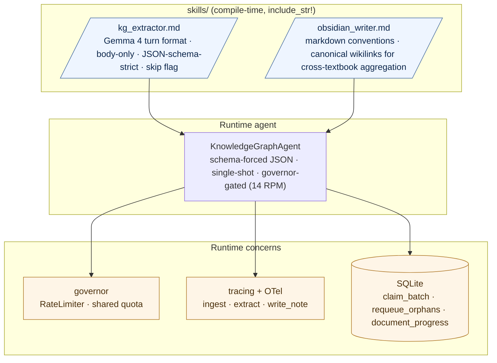
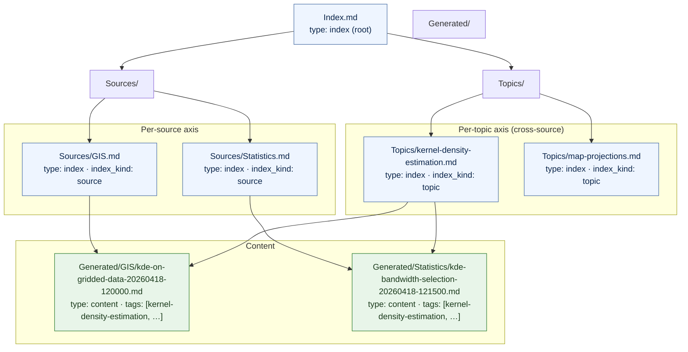

# Information Lab — Edge Knowledge-Graph Agent

An edge-native autonomous pipeline that converts PDFs into a fully
linked Obsidian knowledge graph. It's designed to run on a Raspberry Pi
(or any low-power Linux box), use only the free tier of Google AI
Studio, and survive reboots without losing work.

Drop a PDF into the watched folder → get titled `.md` notes with
`[[wikilinks]]`, YAML frontmatter, and hierarchical index entries under
both a per-source axis (one textbook) and a cross-source Topics axis
(same concept across every textbook that mentions it).

## Architecture



### Data lifecycle (single PDF)



### Agent architecture

A single LLM agent, driven by two skill files compiled into the binary.
The prior deep-research / ReAct stack was removed — on the Pi, the
governor budget is better spent on more extractions than on tool calls.



### Vault layout (two-axis hierarchical index)

Every file under the vault carries `type: index` or `type: content` in
frontmatter — that's the navigation signal a future agent uses to
decide what to load. Adding a new textbook enriches both axes: the
per-source index for that textbook *and* every topic file whose tag the
new notes mention.



**Cap + split.** When an index file exceeds `INDEX_ENTRY_CAP` (default
20), it's automatically split into stable alphabetical buckets
(`a-e / f-j / k-o / p-t / u-z / other`) under a same-named sub-directory,
and the parent becomes a pointer with `split: true` in its frontmatter.
Bucket filenames are stable — adding entries never renames an existing
bucket file, so Obsidian wikilinks stay valid.

## Durable progress tracking

The `documents` table tracks per-file progress so the agent can resume
after being stopped — it doesn't need to run 24/7.

| Column | Role |
|---|---|
| `hash` | SHA-256; dedup + primary key |
| `source_name` | Human-readable label (folder name under watch dir) |
| `discovered_at` | When the file was first seen |
| `extracted_at` | When pdf_oxide finished chunking |
| `completed_at` | Stamped when every chunk for the doc reaches `done`/`error` |

On each batch completion, `maybe_mark_document_complete(hash)` checks
whether any `pending`/`batched` chunks remain for that document;
if none, `completed_at` is set atomically. `SYSTEM_STATUS.md` renders
a progress bar per document.

## Libraries

| Concern | Crate |
|---|---|
| Async runtime | `tokio` (multi-thread, 2 workers) |
| Agent orchestration + LLM backends | `autoagents`, `autoagents-derive` (Google backend) |
| HTTP | `reqwest` (rustls) |
| Filesystem watching | `notify`, `notify-debouncer-full` |
| PDF extraction | `pdf_oxide` |
| Persistent state | `sqlx` (SQLite WAL + migrations) |
| Hashing | `sha2`, `hex` |
| Rate limiting | `governor`, `nonzero_ext` |
| Serde | `serde`, `serde_json` |
| Config | `dotenvy` |
| Errors | `thiserror`, `anyhow` |
| Logging | `tracing`, `tracing-subscriber`, `tracing-appender` |
| OpenTelemetry | `opentelemetry` 0.26, `opentelemetry_sdk`, `opentelemetry-otlp`, `tracing-opentelemetry` 0.27 |
| Time / IDs | `chrono`, `uuid` |

## Configuration

Env-driven, loaded via `dotenvy`. See [`.env.example`](.env.example)
for the authoritative list.

| Var | Default | Meaning |
|---|---|---|
| `WATCH_DIR` | `./public` | Folder to watch for PDFs |
| `VAULT_DIR` | `./public` | Obsidian vault root (same as watch by default) |
| `DB_PATH` | `./.data/state.db` | SQLite file; parent dir auto-created |
| `LOG_DIR` | `./logs` | Rolling JSON log files |
| `GOOGLE_API_KEY` | *(required)* | Google AI Studio key |
| `REASONER_MODEL` | `gemma-4-31b-it` | Heavy reasoner for text chunks |
| `VISION_MODEL` | `gemini-3.1-flash-lite-preview` | Reserved for TocExtractor |
| `RPM_LIMIT` | `14` | Governor ceiling (free tier is 15 RPM) |
| `INDEX_ENTRY_CAP` | `20` | Split threshold for index files |
| `BATCH_TOKEN_TARGET` | `25000` | Tokens accumulated per reasoner call |
| `FS_DEBOUNCE_MS` | `2000` | Syncthing partial-write debounce |
| `STATUS_INTERVAL_SECS` | `300` | `SYSTEM_STATUS.md` regen cadence |
| `OTEL_EXPORTER_OTLP_ENDPOINT` | *(unset)* | Enables OTel when set, e.g. `http://127.0.0.1:4317` |
| `OTEL_SERVICE_NAME` | `edge-kg-agent` | Resource attribute |
| `OTEL_RESOURCE_ATTRIBUTES` | *(unset)* | Extra comma-separated `k=v` |

## Running

### Local dev

```bash
cp .env.example .env     # add GOOGLE_API_KEY
cargo run --release
```

The sample `public/` vault ships with one GIS textbook
(`public/GIS/Essentials of Geographic Information Systems.pdf`) —
the startup scan picks it up and pushes it through the pipeline.

### As a systemd service (Pi)

```bash
cargo build --release
sudo cp target/release/edge-kg-agent /usr/local/bin/
sudo cp systemd/edge-kg-agent.service /etc/systemd/system/
sudo systemctl enable --now edge-kg-agent
journalctl -u edge-kg-agent -f
```

## Observability

Tracing is layered:

1. **stdout** (ANSI, human) — always on.
2. **rolling JSON file** in `$LOG_DIR` — always on.
3. **OpenTelemetry OTLP** — on when `OTEL_EXPORTER_OTLP_ENDPOINT` is
   set. gRPC on `:4317`, HTTP/protobuf on `:4318`.

First-class spans: `ingest` (per PDF) → `extract` (per batch) →
`write_note` (per generated note).

Local Jaeger (OTLP backend + UI) is provided:

```bash
cd deploy/otel
docker compose up -d
export OTEL_EXPORTER_OTLP_ENDPOINT=http://127.0.0.1:4317
cargo run --release
# open http://localhost:16686
```

## Repo layout

```
.
├── src/
│   ├── main.rs             # bootstrap, signal handling
│   ├── config.rs           # env → Config
│   ├── telemetry.rs        # tracing + OTel wiring
│   ├── watcher.rs          # notify + startup scan → mpsc<PathBuf>
│   ├── ingest.rs           # sha256 + pdf_oxide + chunk insert
│   ├── db.rs               # sqlx SQLite access + document progress
│   ├── agents.rs           # KnowledgeGraphAgent, skill injection
│   ├── orchestrator.rs     # glue (ingest consumer + batch reasoner)
│   ├── vault.rs            # two-axis index writer + cap/split
│   ├── status.rs           # periodic SYSTEM_STATUS.md with progress bars
│   └── error.rs            # AppError / AppResult
├── skills/
│   ├── kg_extractor.md     # Gemma 4 turn-format extraction procedure
│   └── obsidian_writer.md  # markdown + canonical-wikilink conventions
├── migrations/
│   ├── 0001_init.sql
│   └── 0002_document_progress.sql
├── deploy/otel/
│   ├── docker-compose.yml  # Jaeger all-in-one 1.76.0
│   └── README.md
├── systemd/
│   └── edge-kg-agent.service
├── public/                 # sample vault (committed, with GIS textbook)
├── Cargo.toml
└── .env.example
```

## Design principles

- **Edge-first.** No cloud-hosted state, no background sync. The SQLite
  WAL + local vault are the system of record.
- **Crash-safe.** `requeue_orphans()` resets any batch that was claimed
  but never finished. A PDF ingested once is never re-ingested (dedup
  by SHA-256). Per-document completion is stamped atomically.
- **Quota-aware.** `governor` enforces the RPM ceiling before any LLM
  call. Chunks are processed sequentially to keep Pi RAM flat.
- **Skill-driven agents.** Small reasoning models behave dramatically
  better with numbered, procedural instructions. Skills are compiled
  into the binary via `include_str!` — edit the `.md`, rebuild, done.
- **Canonical wikilinks.** Entities must be spelled out in full
  (`[[Principal Component Analysis]]`, not `[[PCA]]`) so cross-textbook
  Topic aggregation actually lines up.
- **Observable from day one.** `tracing` everywhere; OpenTelemetry is
  one env var away, and a local Jaeger is one `docker compose up` away.

## License

Apache-2.0
