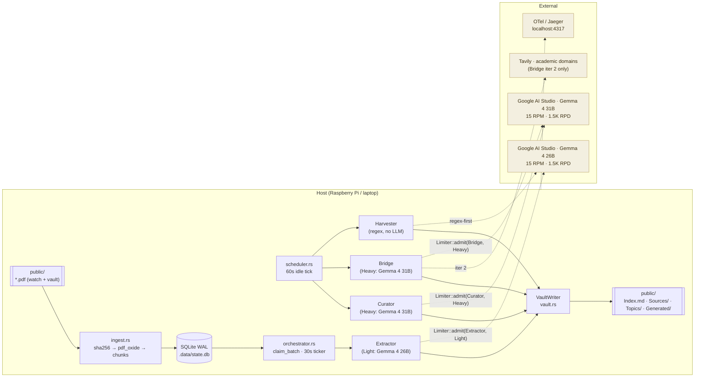

# Information Lab — Edge Knowledge-Graph Agent

An edge-native autonomous pipeline that converts PDFs into a fully linked
Obsidian knowledge graph *and* runs a continuous research layer over it.
Designed to run on a Raspberry Pi (or any low-power Linux box), use only
the free tier of Google AI Studio, and survive reboots without losing
work.

Drop a PDF into the watched folder → get titled `.md` notes with
`[[wikilinks]]`, YAML frontmatter, and hierarchical index entries under
both a per-source axis (one textbook) and a cross-source Topics axis
(same concept across every textbook that mentions it). A pool of
research agents then keeps sifting the vault for cross-textbook
syntheses, mechanistic bridges, and derivational links between topics.

---

## Dual-tier models & throughput

Google AI Studio's free tier gives every Gemma 4 model its own 15 RPM
bucket. Running two models side-by-side effectively doubles throughput:

| Tier | Model | RPM / RPD | Roles |
|------|-------|-----------|-------|
| **Light** | `gemma-4-26b-it` | 15 / 1,500 | Extractor, Harvester (+ ErrorRetrier, FormulaExtractor — planned) |
| **Heavy** | `gemma-4-31b-it` | 15 / 1,500 | Curator, Bridge (+ TheoremProver, DerivationChain, ReportWriter — planned) |

Each tier has an independent global `governor` bucket and independent
per-role daily counters — a burst on one tier never starves the other.
All LLM calls gate through `Limiter::admit(Role)`; the role's tier is
resolved via `Role::tier()`.

```
  Light tier (15 RPM)               Heavy tier (15 RPM)
  ─────────────────                 ─────────────────
   Extractor ─┐                     ┌─ Curator
   Harvester ─┤  ── Limiter.admit ──┤─ Bridge
              │                     └─ (Theorem / Derivation / Report — planned)
              └──── Gemma 4 26B         ──── Gemma 4 31B
```

---

## Architecture



---

## Agents

All agents share an `AgentCtx` with DB, `VaultWriter`, and the shared
`Limiter`. Each agent's entrypoint is instrumented with
`#[tracing::instrument]` so Jaeger shows a span tree per pipeline stage.

| Agent | File | Tier | What it does |
|-------|------|------|--------------|
| **Extractor** | `src/agents/extractor.rs` | Light | PDF chunk → KG JSON via structured output. Explains what each entity *is*, not just lists keywords. |
| **TopicCurator** | `src/agents/curator.rs` | Heavy | When a Topic has gained ≥ K new entries, synthesises a cross-textbook note with verbatim-cited formulas. |
| **BridgeFinder** | `src/agents/bridge.rs` | Heavy | 3-iteration loop (propose → Tavily-refine → critique) finding *mechanistic* links between two Topics in different sources. Emits only when `confidence ≥ τ`. |
| **LiteratureSearch** | `src/agents/search.rs` | — | Tavily client; invoked by Bridge iter 2. Budget-disciplined; six academic-only domains. |
| **FormulaHarvester** | `src/agents/harvester.rs` | Light (regex-first) | Scans `Generated/**.md` for `$$...$$` and `\(...\)` blocks; rewrites `Formulas.md`. LLM fallback reserved for ambiguous blocks. |

**Planned additions** (see `C:\Users\rahul\.claude\plans\i-want-to-update-sleepy-minsky.md` for the full design):

| Agent | Tier | Purpose |
|-------|------|---------|
| FormulaExtractor (hybrid vision) | Light | Render math-dense pages via pdfium, pass to Gemma-4 vision (280-token budget) → LaTeX back into chunk markdown. |
| TheoremProver | Heavy | On high-confidence Bridges, emit formal-style notes with Given / Claim / Proof / Derivation sections. |
| DerivationChain | Heavy | Periodic walk over the formula graph producing derivational chains between topics. |
| ReportWriter | Heavy | Daily synthesis of the last 24h of notes into a prose multi-topic report. |
| ErrorRetrier | Light | Periodic retry of `state='error'` chunks with exponential backoff — replaces the current leave-and-forget behaviour that stranded 300+ chunks in a recent run. |

---

## Vault layout

Two-axis hierarchical index, same as before:

```
{vault}/
  Index.md                     type: index (root) — lists Sources + Topics
  Sources/{source}.md          type: index, index_kind: source
  Topics/{tag}.md              type: index, index_kind: topic   (cross-source)
  Generated/{source}/{slug}-{yyyymmdd-hhmmss}.md   type: content
  Generated/_Syntheses/        TopicCurator output
  Generated/_Bridges/          BridgeFinder output
  Generated/_Theorems/         TheoremProver output (planned)
  Generated/_Derivations/      DerivationChain output (planned)
  Generated/_Reports/          ReportWriter output (planned)
  Formulas.md                  FormulaHarvester output
```

- Every write updates three axes: the source index, every topic index,
  and the root `Index.md`.
- Entries are deduped by the `({rel_path})` marker at the end of each
  bullet.
- When an index exceeds `INDEX_ENTRY_CAP` (default 20), it splits into
  alphabetical buckets (`a-e`, `f-j`, `k-o`, `p-t`, `u-z`, `other`)
  under a same-named sub-directory. **The split state is terminal** —
  a bucket exceeding cap is now a hard error (no silent fallback).

---

## Prompt format (Gemma 4)

All skills under `skills/` are structured for Gemma 4:

- **Role & scope** first, then **constraints**, **output schema**,
  **exemplars**.
- Heavy-tier skills (Curator, Bridge) instruct the model to **think
  step-by-step before answering**. The autoagents chat template owns
  turn framing, so raw `<|turn>` / `<|think|>` tokens are not injected
  into content — the template produces them at serialization.
- `kg_extractor.md` enforces "**explain, don't list**": every entity
  must get ≥ 1 sentence of prose in `markdown_snippet`, and `summary`
  must be 2–3 sentences of content, not a keyword line.
- `bridge_search_refine.md` uses a "LOW thinking" instruction to keep
  iter-2 latency bounded.

---

## Running locally

```bash
# 1. Configure (.env)
cp .env.example .env   # if you keep one; otherwise export inline
export GOOGLE_API_KEY=...
export LIGHT_MODEL=gemma-4-26b-it       # optional; this is the default
export HEAVY_MODEL=gemma-4-31b-it       # optional; this is the default
export WATCH_DIR=./public
export VAULT_DIR=./public
export OTEL_EXPORTER_OTLP_ENDPOINT=http://127.0.0.1:4317   # optional

# 2. Bring up Jaeger (optional, for per-agent spans)
docker compose -f deploy/otel/docker-compose.yml up -d
# UI → http://localhost:16686

# 3. Run
cargo run --release

# 4. Drop PDFs into ./public and watch the vault populate.
```

Jaeger shows one span per agent invocation, each tagged with
`agent.role`, `agent.tier`, and `agent.model`.

---

## Configuration reference

| Env var | Default | Purpose |
|---------|---------|---------|
| `WATCH_DIR` | `./public` | Folder watched for PDFs |
| `VAULT_DIR` | `./public` | Obsidian vault root |
| `DB_PATH` | `./.data/state.db` | SQLite state |
| `LOG_DIR` | `./logs` | Rotating log files |
| `GOOGLE_API_KEY` | **required** | Google AI Studio key |
| `LIGHT_MODEL` | `gemma-4-26b-it` | Light-tier model |
| `HEAVY_MODEL` | `gemma-4-31b-it` | Heavy-tier model |
| `REASONER_MODEL` | *(deprecated)* | Fallback source for `HEAVY_MODEL` when the new var is unset |
| `VISION_MODEL` | `gemini-3.1-flash-lite-preview` | Vision endpoint (reserved) |
| `RPM_LIMIT` | `14` | Per-tier RPM ceiling |
| `RPD_LIMIT` | `1500` | Per-tier daily ceiling |
| `ROLE_SHARE_EXTRACTOR` / `CURATOR` / `BRIDGE` / `HARVESTER` | `60 / 20 / 15 / 5` | Daily quota distribution within a tier |
| `INDEX_ENTRY_CAP` | `20` | Index entries before split; bucket overflow is a **hard error** |
| `CURATE_DELTA_K` | `5` | New entries per Topic before a curate task fires |
| `BRIDGE_MAX_PENDING` | `6` | Queue ceiling for Bridge tasks |
| `BRIDGE_MAX_ITERS` | `3` | Cap on propose → search → critique loop |
| `BRIDGE_CONFIDENCE_TAU` | `0.72` | Acceptance threshold |
| `BRIDGE_MIN_OVERLAP` / `MAX_OVERLAP` | `1 / 5` | Entity overlap band for candidate pairs |
| `BRIDGE_MAX_JACCARD` | `0.6` | Near-duplicate cutoff |
| `SCHEDULER_INTERVAL_SECS` | `60` | Idle-scheduler tick |
| `RESEARCH_INTERVAL_SECS` | `30` | Curator + Bridge drain cadence |
| `TAVILY_API_KEY` | *(empty)* | Blank disables LiteratureSearch |
| `TAVILY_MONTHLY_LIMIT` | `1000` | Vendor monthly cap |
| `TAVILY_DOMAINS` | arxiv / semanticscholar / acm / springer / nature / sciencedirect | Allow-listed domains |
| `OTEL_EXPORTER_OTLP_ENDPOINT` | *(empty)* | gRPC OTLP endpoint; blank → console + file logs only |
| `OTEL_SERVICE_NAME` | `edge-kg-agent` | OTel resource name |

---

## Known limits

- **RAM / CPU.** Chunks process sequentially. Do not add parallel fan-out
  inside the reasoner loop without a matching `Limiter` gate.
- **Tavily free tier.** 1,000 calls / month. Bridge iter 2 is the only
  consumer; the search agent degrades gracefully when the budget is
  exhausted.
- **Error chunks.** The current extractor marks failed chunks
  `state='error'` and does not retry. The **ErrorRetrier** agent
  (planned) addresses this; until then, manual SQL intervention is
  required to re-queue long-lived error chunks.
- **Deep-split overflow.** A single alphabetical bucket exceeding
  `INDEX_ENTRY_CAP` is a hard error. Raise the cap or split the source
  textbook into finer sub-indices.

---

## Build gates

```bash
cargo check                  # must pass before committing
cargo fmt --check
cargo clippy -- -D warnings
```

---

## Repo layout

```
src/            Rust source — one module per role.
skills/         Markdown instruction files for the LLM agents (Gemma-4 structure).
migrations/     SQLx migrations, applied on startup.
systemd/        Production deployment unit.
deploy/otel/    Local Jaeger all-in-one compose for OTel development.
public/         Default watch + vault directory (sample GIS textbook included).
.data/          Runtime state (SQLite DB). Gitignored.
```
