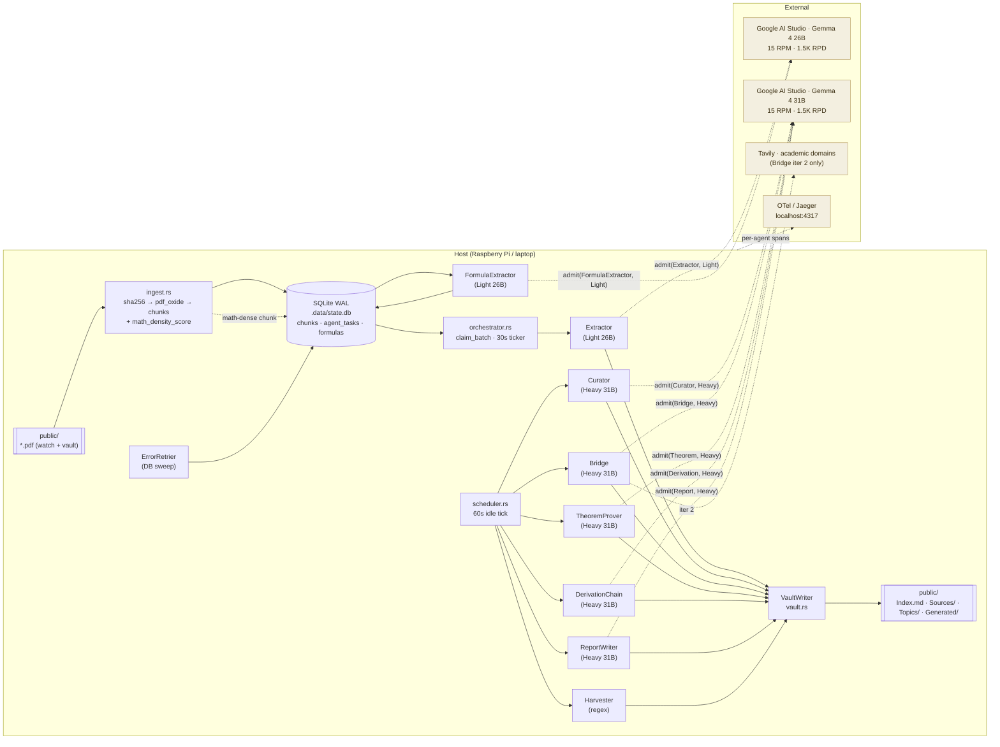

# Information Lab — Edge Knowledge-Graph Agent

An edge-native autonomous pipeline that converts PDFs into a fully linked
Obsidian knowledge graph *and* runs a continuous research layer over it.
Designed to run on a Raspberry Pi (or any low-power Linux box), use only
the free tier of Google AI Studio, and survive reboots without losing
work.

Drop a PDF into the watched folder → get titled `.md` notes with
`[[wikilinks]]`, YAML frontmatter, and hierarchical index entries under
both a per-source axis (one textbook) and a cross-source Topics axis
(same concept across every textbook that mentions it). A pool of
research agents then keeps sifting the vault for cross-textbook
syntheses, mechanistic bridges, theorem-style proofs, derivation chains,
and daily prose reports.

---

## Dual-tier models & throughput

Google AI Studio's free tier gives every Gemma 4 model its own 15 RPM
bucket. Running two models side-by-side effectively doubles throughput:

| Tier | Model | RPM / RPD | Roles |
|------|-------|-----------|-------|
| **Light** | `gemma-4-26b-it` | 15 / 1,500 | Extractor, Harvester, FormulaExtractor, ErrorRetrier |
| **Heavy** | `gemma-4-31b-it` | 15 / 1,500 | Curator, Bridge, TheoremProver, DerivationChain, ReportWriter |

Each tier has an independent global `governor` bucket and independent
per-role daily counters — a burst on one tier never starves the other.
All LLM calls gate through `Limiter::admit(Role)`; the role's tier is
resolved via `Role::tier()`.

```
  Light tier (15 RPM)                Heavy tier (15 RPM)
  ─────────────────                  ─────────────────
   Extractor         ─┐              ┌─ Curator
   Harvester         ─┤              ├─ Bridge
   FormulaExtractor  ─┤ ─ admit(R) ─ ┤─ TheoremProver
   ErrorRetrier      ─┘              ├─ DerivationChain
                                     └─ ReportWriter
       Gemma 4 26B                       Gemma 4 31B
```

---

## Architecture



### Formula salvage pipeline

`pdf_oxide` is text-only, so math glyphs in a PDF are often dropped or
mangled. The salvage path runs inline with ingest:

```
 PDF page markdown ─▶ math_density_score  ─▶ < τ  : skip
                          (formula_detect.rs)
                                │
                                └─▶ ≥ τ  : enqueue FormulaExtract task
                                           (chunk_id, doc_hash, source, score)
                                                     │
                                   orchestrator tick ▼
                                           FormulaExtractorAgent  (Light 26B)
                                                     │
                                           LaTeX + symbols + caption
                                                     │
                                           upsert_formula(…)  → formulas table
                                                     │
                                           FormulaHarvester rewrites
                                           Formulas.md on its own tick
```

Chosen over a vision-based render path: no `pdfium-render` dependency,
no per-page PNG rendering, no extra model — re-uses the same light-tier
Gemma 4 26B under the existing RPM budget.

---

## Agents

All agents share an `AgentCtx` with DB, `VaultWriter`, and the shared
`Limiter`. Each agent's entrypoint is instrumented with
`#[tracing::instrument]` so Jaeger shows a span tree per pipeline stage,
and each claim emits an `info!(target: "agent.spawn", ...)` event so the
fan-out is visible on a single `scheduler.tick` span.

| Agent | File | Tier | What it does |
|-------|------|------|--------------|
| **Extractor** | `src/agents/extractor.rs` | Light | PDF chunk → KG JSON via structured output. Explains what each entity *is*, not just lists keywords. |
| **FormulaExtractor** | `src/agents/formula_extractor.rs` | Light | Enqueued by `ingest.rs` when a chunk's math-density score crosses τ. Salvages formulas that `pdf_oxide` dropped and feeds them into the `formulas` table. |
| **FormulaHarvester** | `src/agents/harvester.rs` | Light (regex-first) | Scans `Generated/**.md` for `$$...$$` and `\(...\)` blocks; rewrites `Formulas.md`. Uses the shared formula store so FormulaExtractor output appears in the same index. |
| **ErrorRetrier** | `src/agents/retrier.rs` | Light (DB sweep) | Periodic sweep of `chunks.state='error'`. Promotes to `pending` with exponential backoff up to `ERROR_RETRY_MAX`, then to `failed_final`. No more silently stranded chunks. |
| **TopicCurator** | `src/agents/curator.rs` | Heavy | When a Topic has gained ≥ K new entries, synthesises a cross-textbook note with verbatim-cited formulas. |
| **BridgeFinder** | `src/agents/bridge.rs` | Heavy | 3-iteration loop (propose → Tavily-refine → critique) finding *mechanistic* links between two Topics in different sources. Emits only when `confidence ≥ τ`. |
| **TheoremProver** | `src/agents/theorem.rs` | Heavy | Gated on high-confidence bridges. Emits formal-style notes to `Generated/_Theorems/` with **Given**, **Claim**, **Proof sketch**, **Derivation**, **References** sections. |
| **DerivationChain** | `src/agents/derivation.rs` | Heavy | Periodic walk over the formula graph, producing derivational chains `f₁ → … → fₙ` to `Generated/_Derivations/`. |
| **ReportWriter** | `src/agents/report.rs` | Heavy | Daily (`REPORT_INTERVAL_SECS`) prose synthesis of the last 24 h of Syntheses + Bridges + Theorems to `Generated/_Reports/{YYYY-MM-DD}.md`. |
| **LiteratureSearch** | `src/agents/search.rs` | — | Tavily client; invoked by Bridge iter 2 only. Budget-disciplined; six academic-only domains. |

---

## Vault layout

Two-axis hierarchical index:

```
{vault}/
  Index.md                     type: index (root) — lists Sources + Topics
  Sources/{source}.md          type: index, index_kind: source
  Topics/{tag}.md              type: index, index_kind: topic   (cross-source)
  Generated/{source}/{slug}-{yyyymmdd-hhmmss}.md   type: content
  Generated/_Syntheses/        TopicCurator output
  Generated/_Bridges/          BridgeFinder output
  Generated/_Theorems/         TheoremProver output
  Generated/_Derivations/      DerivationChain output
  Generated/_Reports/          ReportWriter output
  Formulas.md                  Harvester + FormulaExtractor output
```

- Every write updates three axes: the source index, every topic index,
  and the root `Index.md`.
- Entries are deduped by the `({rel_path})` marker at the end of each
  bullet.
- When an index exceeds `INDEX_ENTRY_CAP` (default 20), it splits into
  alphabetical buckets (`a-e`, `f-j`, `k-o`, `p-t`, `u-z`, `other`)
  under a same-named sub-directory. **The split state is terminal** —
  a bucket exceeding cap is now a hard error (no silent fallback).

---

## Prompt format (Gemma 4)

All skills under `skills/` are structured for Gemma 4:

- **Role & scope** first, then **constraints**, **output schema**,
  **exemplars**.
- Heavy-tier skills (Curator, Bridge, Theorem, Derivation, Report)
  instruct the model to think step-by-step before answering. The
  autoagents chat template owns turn framing, so raw control tokens are
  not injected into content — the template produces them at
  serialization.
- `kg_extractor.md` enforces "**explain, don't list**": every entity
  must get ≥ 1 sentence of prose in `markdown_snippet`, and `summary`
  must be 2–3 sentences of content, not a keyword line.
- `bridge_search_refine.md` uses a "LOW thinking" instruction to keep
  iter-2 latency bounded.
- `formula_extractor.md` forbids inventing context and mandates
  verbatim LaTeX — only formulas visibly present in the chunk survive.

---

## Running locally

```bash
# 1. Configure (.env)
cp .env.example .env   # if you keep one; otherwise export inline
export GOOGLE_API_KEY=...
export LIGHT_MODEL=gemma-4-26b-it       # optional; this is the default
export HEAVY_MODEL=gemma-4-31b-it       # optional; this is the default
export WATCH_DIR=./public
export VAULT_DIR=./public
export OTEL_EXPORTER_OTLP_ENDPOINT=http://127.0.0.1:4317   # optional

# 2. Bring up Jaeger (optional, for per-agent spans)
docker compose -f deploy/otel/docker-compose.yml up -d
# UI → http://localhost:16686

# 3. Run
cargo run --release

# 4. Drop PDFs into ./public and watch the vault populate.
```

Jaeger spans of interest:

- `ingest` · `extract` · `write_note` (ingest path)
- `curate` · `bridge.iterate` · `bridge.propose` · `bridge.critique`
- `agent.theorem` · `agent.derivation` · `agent.report`
- `agent.formula_extract` · `agent.retry`
- `limiter.admit` (tier + role as attributes)

Each claim also emits an `agent.spawn` event within the surrounding
`scheduler.tick` / orchestrator span so the fan-out is visible at a
glance.

---

## Configuration reference

| Env var | Default | Purpose |
|---------|---------|---------|
| `WATCH_DIR` | `./public` | Folder watched for PDFs |
| `VAULT_DIR` | `./public` | Obsidian vault root |
| `DB_PATH` | `./.data/state.db` | SQLite state |
| `LOG_DIR` | `./logs` | Rotating log files |
| `GOOGLE_API_KEY` | **required** | Google AI Studio key |
| `LIGHT_MODEL` | `gemma-4-26b-it` | Light-tier model |
| `HEAVY_MODEL` | `gemma-4-31b-it` | Heavy-tier model |
| `REASONER_MODEL` | *(deprecated)* | Fallback source for `HEAVY_MODEL` when the new var is unset |
| `CURATOR_MODEL` / `BRIDGE_MODEL` / `THEOREM_MODEL` / `DERIVATION_MODEL` / `REPORT_MODEL` | *(empty → `HEAVY_MODEL`)* | Per-role overrides on the heavy tier |
| `FORMULA_MODEL` | *(empty → `LIGHT_MODEL`)* | Override for FormulaExtractor only |
| `VISION_MODEL` | `gemini-3.1-flash-lite-preview` | Reserved for future vision path |
| `RPM_LIMIT` | `14` | Per-tier RPM ceiling |
| `RPD_LIMIT` | `1500` | Per-tier daily ceiling |
| `ROLE_SHARE_EXTRACTOR` / `HARVESTER` / `FORMULA` | `50 / 5 / 10` | Light-tier daily quota shares (extractor + retrier + formula + harvester) |
| `ROLE_SHARE_CURATOR` / `BRIDGE` / `THEOREM` / `DERIVATION` / `REPORT` | `15 / 12 / 8 / 7 / 3` | Heavy-tier daily quota shares |
| `FORMULA_DETECT_TAU` | `0.12` | Math-density cutoff above which ingest enqueues a FormulaExtract task |
| `INDEX_ENTRY_CAP` | `20` | Index entries before split; bucket overflow is a **hard error** |
| `CURATE_DELTA_K` | `5` | New entries per Topic before a curate task fires |
| `BRIDGE_MAX_PENDING` | `6` | Queue ceiling for Bridge tasks |
| `BRIDGE_MAX_ITERS` | `3` | Cap on propose → search → critique loop |
| `BRIDGE_CONFIDENCE_TAU` | `0.72` | Bridge acceptance threshold |
| `BRIDGE_MIN_OVERLAP` / `MAX_OVERLAP` | `1 / 5` | Entity overlap band for candidate pairs |
| `BRIDGE_MAX_JACCARD` | `0.6` | Near-duplicate cutoff |
| `THEOREM_CONFIDENCE_TAU` | `0.85` | Bridge confidence required to trigger a Theorem task |
| `THEOREM_ENQUEUE_BATCH` | `2` | Max Theorem tasks enqueued per scheduler tick |
| `DERIVATION_MIN_FORMULAS` | `3` | Minimum formulas on a seed topic before Derivation runs |
| `REPORT_INTERVAL_SECS` | `86400` | Cadence of Report tasks |
| `ERROR_RETRY_INTERVAL_SECS` | `300` | ErrorRetrier sweep cadence |
| `ERROR_RETRY_MAX` | `3` | Retries before `state='failed_final'` |
| `ERROR_RETRY_BACKOFF_SECS` | `300` | Base backoff for exponential retry |
| `ERROR_RETRY_BATCH` | `20` | Max error chunks promoted per sweep |
| `SCHEDULER_INTERVAL_SECS` | `60` | Idle-scheduler tick |
| `RESEARCH_INTERVAL_SECS` | `30` | Curator + Bridge + heavy-research + formula drain cadence |
| `TAVILY_API_KEY` | *(empty)* | Blank disables LiteratureSearch |
| `TAVILY_MONTHLY_LIMIT` | `1000` | Vendor monthly cap |
| `TAVILY_DOMAINS` | arxiv / semanticscholar / acm / springer / nature / sciencedirect | Allow-listed domains |
| `OTEL_EXPORTER_OTLP_ENDPOINT` | *(empty)* | gRPC OTLP endpoint; blank → console + file logs only |
| `OTEL_SERVICE_NAME` | `edge-kg-agent` | OTel resource name |

---

## Known limits

- **RAM / CPU.** Chunks process sequentially. Do not add parallel fan-out
  inside the reasoner loop without a matching `Limiter` gate.
- **Tavily free tier.** 1,000 calls / month. Bridge iter 2 is the only
  consumer; the search agent degrades gracefully when the budget is
  exhausted.
- **Error chunks.** Now handled by ErrorRetrier with exponential backoff
  capped at `ERROR_RETRY_MAX`; after the cap, chunks move to
  `state='failed_final'` and require manual inspection.
- **Formula salvage is text-only.** A chunk whose source PDF rendered
  the math as raster glyphs (not text) will still be lost — the
  math-density heuristic can only flag what `pdf_oxide` produced. A
  vision-based fallback is parked behind `VISION_MODEL` for future work.
- **Deep-split overflow.** A single alphabetical bucket exceeding
  `INDEX_ENTRY_CAP` is a hard error. Raise the cap or split the source
  textbook into finer sub-indices.

---

## Build gates

```bash
cargo check --all-targets    # must pass before committing
cargo fmt --check
cargo clippy --all-targets -- -D warnings
cargo test                   # tests/vault_split.rs + tests/limiter_tiers.rs
```

---

## Repo layout

```
src/            Rust source — one module per role.
  agents/       One file per agent (extractor, curator, bridge, theorem, derivation, report, harvester, formula_extractor, retrier, search).
  formula_detect.rs  Math-density heuristic used by ingest.rs.
skills/         Markdown instruction files for the LLM agents (Gemma-4 structure).
migrations/     SQLx migrations, applied on startup.
systemd/        Production deployment unit.
deploy/otel/    Local Jaeger all-in-one compose for OTel development.
public/         Default watch + vault directory (sample textbooks included).
.data/          Runtime state (SQLite DB). Gitignored.
```
