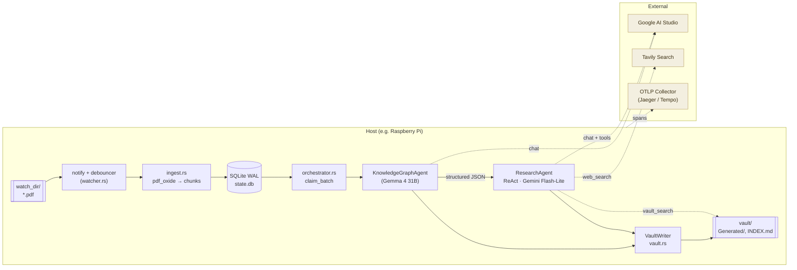
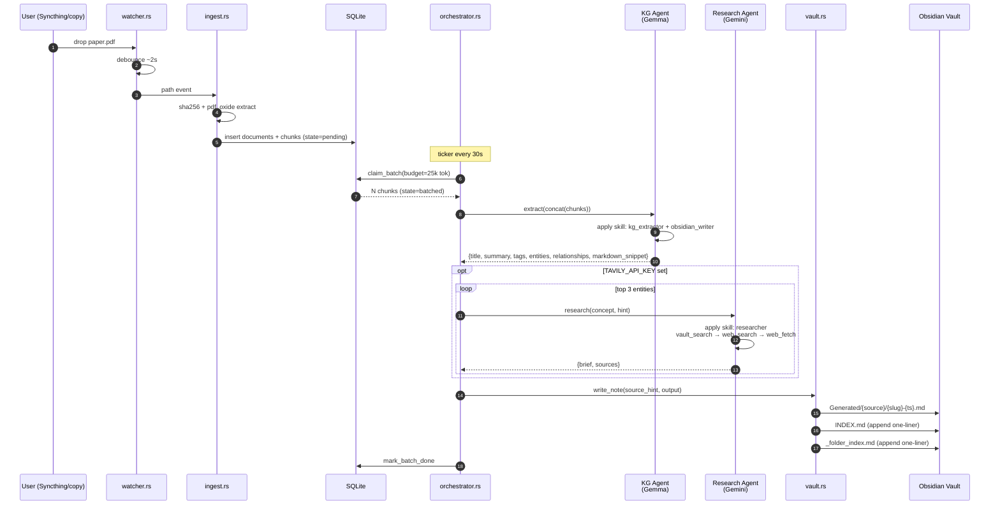
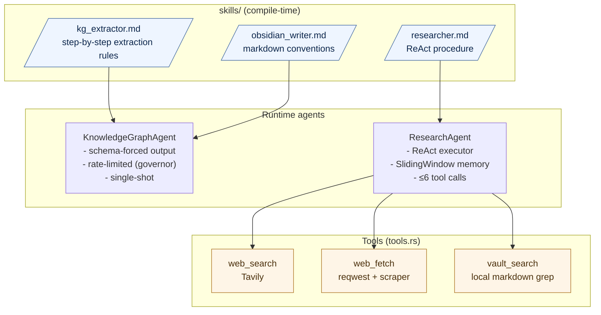

# Information Lab — Edge Knowledge-Graph Agent

An edge-native autonomous pipeline that converts PDFs into a fully
linked Obsidian knowledge graph. It's designed to run on a Raspberry Pi
(or any low-power Linux box), use only the free tier of Google AI
Studio, and survive reboots without losing work.

Drop a PDF into the watched folder → get a titled `.md` note with
`[[wikilinks]]`, YAML frontmatter, and a one-line entry in `INDEX.md`.
Optionally, a research agent enriches key concepts with cited external
context.

## Architecture



### Data lifecycle (single PDF)



### Agentic layer

Two agents, both driven by skill files rather than inline prompts. The
skill content is compiled into the binary via `include_str!`, so edits
to `skills/*.md` are picked up on the next `cargo build` — no runtime
filesystem dependency.



#### Why skills?

Small reasoning models (Gemma 4 31B, Gemini 3.1 Flash-Lite) behave
dramatically better with numbered, procedural instructions than with
free-form system prompts. Each skill file is a checklist the model
follows mechanically — think of it as a contract with the LLM. Updating
a skill is the supported way to change agent behavior.

## Obsidian output

The vault layout after a few runs looks like:

```
vault/
├── INDEX.md                                 ← root index (every note)
└── Generated/
    ├── {source-hash-or-filename}/
    │   ├── _folder_index.md                 ← per-source index
    │   ├── crispr-gene-drive-regulation-20260417-143022.md
    │   └── off-target-mitigation-20260417-143055.md
    └── {another-source}/
        ├── _folder_index.md
        └── …
```

`INDEX.md` entries are one line each:

```markdown
- [CRISPR Gene Drive Regulation](Generated/paper1/crispr-gene-drive-regulation-20260417-143022.md) — US regulatory framework as of 2026 covering contained labs, field trials, and mosquito releases. · #biotech #regulation #crispr
```

This makes the index cheap to read — both for humans navigating the
vault and for the `vault_search` tool the research agent uses — so
subsequent runs don't waste tokens rediscovering what's already there.

## Libraries

| Concern | Crate |
|---|---|
| Async runtime | `tokio` (multi-thread, 2 workers) |
| Agent orchestration + LLM backends | `autoagents`, `autoagents-derive` (Google backend) |
| HTTP | `reqwest` (rustls) |
| Filesystem watching | `notify`, `notify-debouncer-full` |
| PDF extraction | `pdf_oxide` (parallel) |
| Persistent state | `sqlx` (SQLite WAL, migrations) |
| Hashing | `sha2`, `hex` |
| Rate limiting | `governor`, `nonzero_ext` |
| Serde | `serde`, `serde_json` |
| Config | `dotenvy` |
| Errors | `thiserror`, `anyhow` |
| Logging | `tracing`, `tracing-subscriber`, `tracing-appender` |
| **OpenTelemetry** | `opentelemetry`, `opentelemetry_sdk`, `opentelemetry-otlp`, `tracing-opentelemetry`, `opentelemetry-semantic-conventions` |
| HTML scraping (research agent) | `scraper` |
| Time | `chrono` |
| IDs | `uuid` |

## Configuration

All configuration is env-driven (`.env` file supported via `dotenvy`).
See [`.env.example`](.env.example) for the authoritative list. The most
important knobs:

| Var | Meaning |
|---|---|
| `WATCH_DIR` | Folder to watch for PDFs (Syncthing works well) |
| `VAULT_DIR` | Obsidian vault root |
| `GOOGLE_API_KEY` | Google AI Studio key |
| `TAVILY_API_KEY` | Optional — enables the research agent |
| `REASONER_MODEL` | Default: `gemma-4-31b-it` |
| `VISION_MODEL` | Default: `gemini-3.1-flash-lite-preview` |
| `RPM_LIMIT` | Governor bucket, default 14 (free tier is 15 RPM) |
| `BATCH_TOKEN_TARGET` | How many token-estimates to accumulate per batch |
| `OTEL_EXPORTER_OTLP_ENDPOINT` | Enables OTel export when set |
| `OTEL_SERVICE_NAME` | Resource attribute (`service.name`) |
| `OTEL_RESOURCE_ATTRIBUTES` | Extra comma-separated `k=v` attrs |

## Running

### Local dev (Windows / macOS / Linux)

```bash
cp .env.example .env     # edit paths + API key
cargo run --release
```

### As a systemd service (Pi)

```bash
cargo build --release
sudo cp target/release/edge-kg-agent /usr/local/bin/
sudo cp systemd/edge-kg-agent.service /etc/systemd/system/
sudo systemctl enable --now edge-kg-agent
journalctl -u edge-kg-agent -f
```

## Observability

Tracing is layered:

1. **stdout** (ANSI, human) — always on.
2. **rolling JSON file** in `$LOG_DIR` — always on.
3. **OpenTelemetry OTLP** — on when `OTEL_EXPORTER_OTLP_ENDPOINT` is
   set. Uses gRPC when the endpoint contains `:4317`, HTTP/protobuf
   when it contains `:4318`.

The spans you'll care about:

```
ingest               (per PDF)
  → (db writes)
extract              (per batch — KG agent call)
research             (per concept, when enabled)
  → vault_search
  → web_search
  → web_fetch
enrich               (parent of the above research calls)
write_note           (per generated note)
```

Example Jaeger-compatible local setup:

```bash
docker run --rm -p 16686:16686 -p 4317:4317 jaegertracing/all-in-one:latest
# then:
export OTEL_EXPORTER_OTLP_ENDPOINT=http://127.0.0.1:4317
cargo run --release
# open http://localhost:16686
```

## Repo layout

```
.
├── src/
│   ├── main.rs             # bootstrap, signal handling
│   ├── config.rs           # env → Config
│   ├── telemetry.rs        # tracing + OTel wiring
│   ├── watcher.rs          # notify → mpsc<PathBuf>
│   ├── ingest.rs           # hash + pdf_oxide + chunk insert
│   ├── db.rs               # sqlx SQLite access
│   ├── agents.rs           # KG + Research agents, skill injection
│   ├── tools.rs            # web_search, web_fetch, vault_search
│   ├── orchestrator.rs     # glue (ingest + batch consumer)
│   ├── vault.rs            # markdown writer + INDEX.md
│   ├── status.rs           # periodic SYSTEM_STATUS.md
│   └── error.rs            # AppError / AppResult
├── skills/
│   ├── kg_extractor.md     # KG agent system prompt
│   ├── researcher.md       # research agent procedure
│   └── obsidian_writer.md  # markdown conventions
├── migrations/
│   └── 0001_init.sql
├── systemd/
│   └── edge-kg-agent.service
├── Cargo.toml
└── .env.example
```

## Design principles

- **Edge-first.** No cloud-hosted state, no background sync. The SQLite
  WAL + local vault are the system of record.
- **Crash-safe.** `requeue_orphans()` resets any batch that was claimed
  but never finished. A PDF ingested once is never re-ingested (dedup
  by SHA-256).
- **Quota-aware.** `governor` enforces the RPM ceiling before we call
  the LLM; research is serialized and capped at 3 concepts per note.
- **Skill-driven agents.** The behavior of a small model is its prompt.
  Change the prompt by editing a file, not by editing Rust.
- **Observable from day one.** `tracing` everywhere; OpenTelemetry is
  one env var away.

## License

MIT OR Apache-2.0
