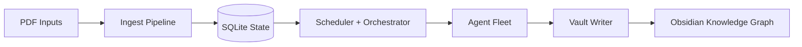
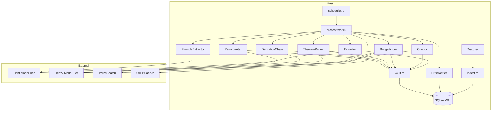

# Architecture

This document explains the runtime architecture at two levels: conceptual and detailed.

## 1) Conceptual overview

## 2) Runtime topology (detailed)

## 3) Control boundaries

- **Ingest boundary**: file detection, hashing, chunking, and DB insertion.
- **Reasoning boundary**: orchestrator claims work and dispatches agents.
- **Persistence boundary**: DB task state and usage/event logging.
- **Presentation boundary**: vault writing and index regeneration.

## 4) Design principles

- Eventual progress over strict real-time output.
- Rate-limit aware scheduling per model tier.
- Guarded emission for confidence-sensitive outputs.
- Observable async control flow via tracing spans/events.
