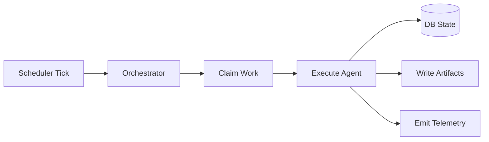

# Developer Guide

## 1) Scope

This guide covers system internals, extension points, and expected engineering practices.

## 2) Codebase map

- `src/orchestrator.rs`: task spawning and runtime coordination.
- `src/workflow.rs`: Sequential / Parallel / Loop workflow primitives.
- `src/agents/*.rs`: role-specific agent implementations.
- `src/db.rs` + `migrations/*.sql`: persistence and task state.
- `src/vault.rs`: markdown and index writing.
- `skills/*.md`: model behavior specs/prompts.

## 3) Runtime responsibilities

## 4) Agent systems available

### Core extraction

- **Extractor**: chunk to structured KG output.
- **FormulaExtractor**: salvage formulas from math-dense chunks.
- **FormulaHarvester**: aggregate formulas into `Formulas.md`.
- **ErrorRetrier**: retries errored chunks with backoff.

### Research agents

- **TopicCurator**: topic-level synthesis when new material arrives.
- **BridgeFinder**: iterative mechanism links between topics.
- **TheoremProver**: formal-style proof notes based on confident bridges.
- **DerivationChain**: equation progression notes.
- **ReportWriter**: daily narrative synthesis.

### Tooling/system agents

- **LiteratureSearch**: constrained external search (bridge loop support).

## 5) Add a new agent (standard workflow)

1. Add prompt spec in `skills/`.
2. Implement module in `src/agents/`.
3. Export module in `src/agents/mod.rs`.
4. Wire scheduling/orchestration in `src/orchestrator.rs`.
5. Add/adjust DB task types if needed.
6. Update architecture + research docs.

## 6) Engineering standards

- Keep workflows deterministic and observable.
- Prefer bounded loops and explicit thresholds.
- Preserve idempotency for re-runs/retries.
- Add tracing span boundaries for new control-flow stages.

See also:

- [Documentation Standards](documentation-standards.md)
- [Operations Runbook](operations-runbook.md)
