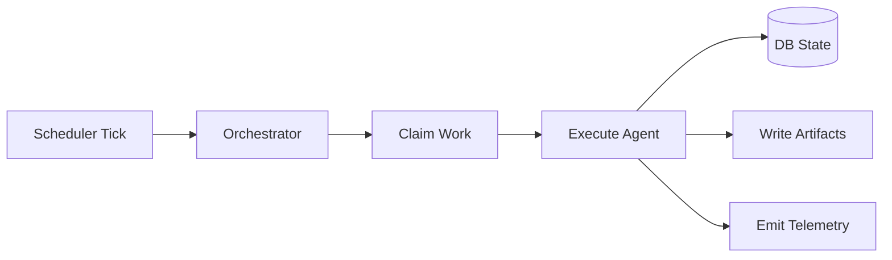

# Developer Guide

## 1) Scope

This guide covers system internals, extension points, and expected engineering practices.

## 2) Codebase map

- `src/main.rs`: runtime bootstrap, model preflight, task loop wiring, graceful shutdown.
- `src/orchestrator.rs`: ingest/reason/research/task-drain execution loops.
- `src/scheduler.rs`: periodic task enqueue logic (curate/bridge/theorem/derivation/report).
- `src/api.rs`: HTTP API (`/research/request`, `/research/{id}`, `/research/{id}/events`, `/monitor/executions`, `/monitor/executions/{id}`).
- `src/status.rs`: monitoring document writer (`SYSTEM_STATUS.md`).
- `src/workflow.rs`: Sequential / Parallel / Loop workflow primitives.
- `src/agents/*.rs`: role-specific agent implementations.
- `src/db.rs` + `migrations/*.sql`: persistence, queue state, event/usage tracking.
- `src/vault.rs`: markdown artifact/index writing and index splitting.
- `src/telemetry.rs`: tracing layers + optional OTLP exporter setup.
- `skills/*.md`: model behavior specs/prompts.
- `.github/workflows/ci-cd.yml`: CI build/test and tag-gated release artifact pipeline.

## 3) Runtime responsibilities

## 4) Agent systems available

Each role maps to a concrete `AgentTaskKind` and consumes either the light or heavy limiter tier.

### Core extraction

- **Extractor**: chunk to structured KG output.
- **FormulaExtractor**: salvage formulas from math-dense chunks.
- **FormulaHarvester**: aggregate formulas into `Formulas.md`.
- **ErrorRetrier**: retries errored chunks with backoff.

### Research agents

- **TopicCurator**: topic-level synthesis when new material arrives.
- **BridgeFinder**: iterative mechanism links between topics.
- **TheoremProver**: formal-style proof notes based on confident bridges.
- **DerivationChain**: equation progression notes.
- **ReportWriter**: daily narrative synthesis.
- **ResearchRequest**: ad-hoc problem-solving lane with solvability gate and bounded iterations.

### Tooling/system agents

- **LiteratureSearch**: constrained external search (bridge loop support).

### Monitoring + observability surfaces

- **Status writer**: periodic `SYSTEM_STATUS.md` queue/usage/progress summary.
- **Agent events**: persisted to DB for timeline/debug and surfaced in status/API reads.
- **Research API**: ad-hoc request lifecycle introspection endpoints.
- **OpenTelemetry**: optional OTLP exporter (`OTEL_EXPORTER_OTLP_ENDPOINT`).

## 5) Add a new agent (standard workflow)

1. Add prompt spec in `skills/`.
2. Implement module in `src/agents/`.
3. Export module in `src/agents/mod.rs`.
4. Wire scheduling/orchestration in `src/orchestrator.rs`.
5. Add/adjust DB task types if needed.
6. Update architecture + research docs.

## 6) Engineering standards

- Keep workflows deterministic and observable.
- Prefer bounded loops and explicit thresholds.
- Preserve idempotency for re-runs/retries.
- Add tracing span boundaries for new control-flow stages.

## 7) CI/CD workflow

GitHub Actions now enforces the default integration and release path:

- On `push` to `main` and on every `pull_request`, run:
  - `cargo build --verbose`
  - `cargo test --all-targets`
- On tags matching `v*` (after CI passes), run release job:
  - `cargo build --release`
  - upload `dist/edge-kg-agent` as an artifact
  - attach the binary to the corresponding GitHub release

When changing runtime behavior, keep docs and tests in the same PR so CI validates
implementation + documentation drift together.

See also:

- [Documentation Standards](documentation-standards.md)
- [Operations Runbook](operations-runbook.md)
