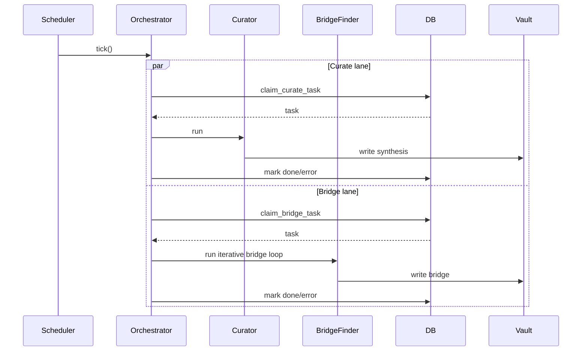
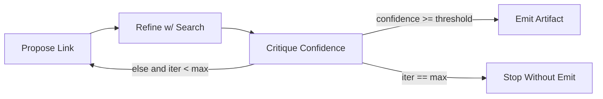
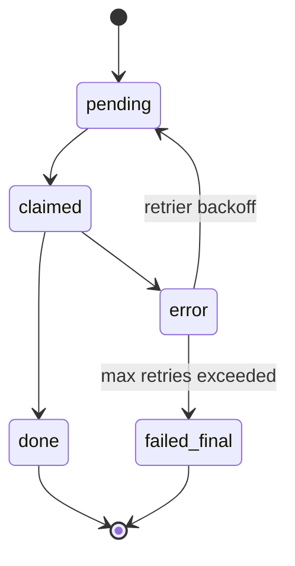

# Research Loop

This document describes the lifecycle and control logic for continuous research generation.

## 1) Loop objective

Transform extracted knowledge into higher-order artifacts (syntheses, bridges, theorems, derivations, reports) on a recurring schedule.

## 2) Workflow primitives

The runtime uses three primitives:

- **Sequential**: deterministic stage chaining.
- **Parallel**: concurrent drains for independent work classes.
- **Loop**: bounded iterative refinement with explicit stop conditions.

## 3) Research tick sequence

## 4) Ad-hoc research request loop (API-triggered)

The runtime now supports externally-triggered research requests that are queued as
`Research` tasks and drained on the same periodic cadence as the other research lanes.

### Request endpoint

- `POST /research/request`
- Payload:
  - `problem` (required, non-empty string)
  - `max_iterations` (optional, clamped to `1..=6`, default `2`)
  - `skills_scope` (optional list of strings)
  - `telegram_chat_id` / `telegram_message_id` (optional metadata passthrough)
- Response: `202 Accepted` with `{ "task_id": <id>, "status": "queued" }`

### Read endpoints

- `GET /research/{id}` returns a summary envelope plus ordered lifecycle events.
- `GET /research/{id}/events` returns raw lifecycle events only.
- `GET /monitor/executions?limit=20` lists recent execution IDs with token totals and lifecycle flags.
- `GET /monitor/executions/{id}` returns per-role/phase/model/tool execution patterns plus full events.

### Solvability gate

Before any solve pass is attempted, the orchestrator computes a lightweight
coverage score from:

- note-context hits (weighted 75%)
- formula-context hits (weighted 25%)

If coverage is below threshold (or the note hit minimum is not met), the request is
finalized as `UNSOLVABLE_INSUFFICIENT_KNOWLEDGE` and a research artifact is still
written with explicit missing-knowledge hints.

If solvable, the request proceeds to the iterative research agent using the resolved
topic and formula context.

## 5) Bridge iterative loop (bounded)

## 6) State model

## 7) Guardrails and SLO-oriented controls

- Per-role limiter admission controls throughput.
- Separate light/heavy tiers prevent starvation.
- Confidence thresholds gate publication of speculative outputs.
- Retries are bounded to prevent infinite churn.
- Research requests are gated by local-knowledge solvability checks.

## 8) Debugging checklist

- Verify ticks are firing at expected intervals.
- Verify claim functions return eligible tasks.
- Verify limiter is admitting target roles.
- Inspect error-to-retry transitions for stuck records.
- For API-triggered requests, inspect `/research/{id}/events` for gate/finalize phases.
