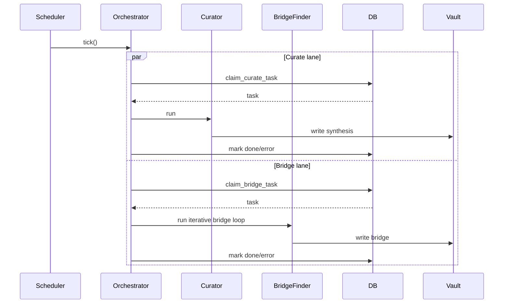
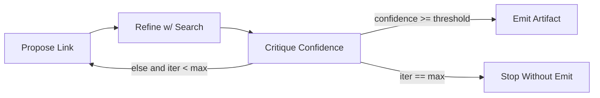
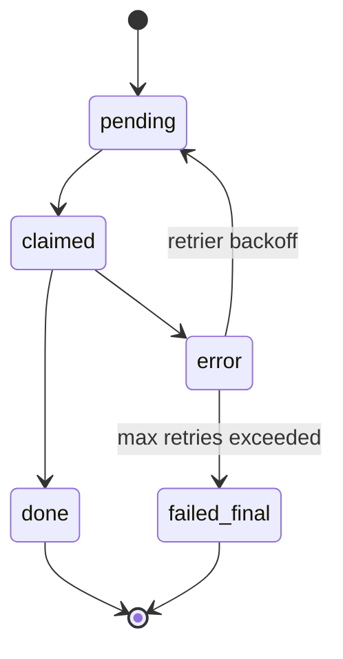

# Research Loop

This document describes the lifecycle and control logic for continuous research generation.

## 1) Loop objective

Transform extracted knowledge into higher-order artifacts (syntheses, bridges, theorems, derivations, reports) on a recurring schedule.

## 2) Workflow primitives

The runtime uses three primitives:

- **Sequential**: deterministic stage chaining.
- **Parallel**: concurrent drains for independent work classes.
- **Loop**: bounded iterative refinement with explicit stop conditions.

## 3) Research tick sequence

## 4) Bridge iterative loop (bounded)

## 5) State model

## 6) Guardrails and SLO-oriented controls

- Per-role limiter admission controls throughput.
- Separate light/heavy tiers prevent starvation.
- Confidence thresholds gate publication of speculative outputs.
- Retries are bounded to prevent infinite churn.

## 7) Debugging checklist

- Verify ticks are firing at expected intervals.
- Verify claim functions return eligible tasks.
- Verify limiter is admitting target roles.
- Inspect error-to-retry transitions for stuck records.
