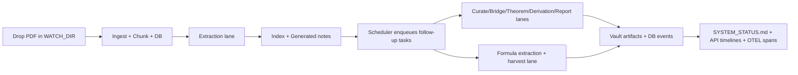

# User Guide

This guide is for operators who want to run Information Lab reliably and understand every output surface (notes, research artifacts, API timelines, and monitoring files) without changing Rust code.

## 1) What Information Lab does

Information Lab continuously converts PDFs into an Obsidian-oriented knowledge workspace and then runs follow-up research loops over the extracted notes.

Core capabilities:

- Watches a folder for new PDFs and ingests them into SQLite-backed state.
- Extracts structured note content from chunks.
- Detects math-dense chunks and runs a dedicated formula extraction lane.
- Maintains topic/source indexes and generated artifact families.
- Runs scheduled research agents (curation, bridges, theorem, derivation, report).
- Accepts ad-hoc research requests through an HTTP API.
- Emits monitoring signals through `SYSTEM_STATUS.md`, logs, and optional OTLP tracing.

## 2) Prerequisites

- Linux host (server/laptop/Raspberry Pi).
- Rust toolchain (`cargo`, `rustc`).
- Google AI Studio API key in `GOOGLE_API_KEY`.
- Writable directories for watch + vault + DB parent path.

## 3) Minimal setup

1. Set required environment variables:
   - `GOOGLE_API_KEY`
2. Set core paths (recommended):
   - `WATCH_DIR` (default `./public`)
   - `VAULT_DIR` (default `./public`)
   - `DB_PATH` (default `./.data/state.db`)
3. Optional but useful:
   - `LIGHT_MODEL`, `HEAVY_MODEL`, `VISION_MODEL`
   - `RESEARCH_API_BIND` (default `127.0.0.1:8090`)
4. Start:

```bash
cargo run
```

5. Drop PDFs into `WATCH_DIR`.

## 4) End-to-end runtime flow



## 5) Output structure in `VAULT_DIR`

### Core indexes

- `Index.md`: top-level index.
- `Sources/*.md`: per-source pages.
- `Topics/*.md`: cross-source topical indexes.

### Generated artifacts

- `Generated/*/_Syntheses/*.md` (topic curation outputs)
- `Generated/*/_Bridges/*.md` (cross-topic bridge hypotheses)
- `Generated/*/_Theorems/*.md` (confidence-gated theorem notes)
- `Generated/*/_Derivations/*.md` (formula progression notes)
- `Generated/*/_Reports/*.md` (daily synthesized reports)

### Monitoring + formula surfaces

- `SYSTEM_STATUS.md`: queue depth, usage counters, doc progress, recent agent events.
- `Formulas.md`: harvested formula index.

## 6) Built-in features and how they behave

### Ingestion and extraction

- PDF watcher debounces file events before ingest.
- Duplicate documents are ignored via content hashing.
- Chunks are batched by token estimate and processed by extractor.
- Failed batches are marked and later eligible for bounded retries.

### Research scheduler (automatic)

On each scheduler tick, the runtime can enqueue:

- **Curate** tasks when a topic grows by `CURATE_DELTA_K` entries.
- **Bridge** tasks for cross-source topic pairs with mid-band overlap.
- **Theorem** tasks from high-confidence bridge rows.
- **Derivation** tasks for topics with enough formula-backed notes.
- **Report** task once per calendar day.

### Formula pipeline

- Math-density scoring flags chunks for `FormulaExtract` tasks.
- Formula extraction writes normalized formula records.
- Harvester compiles formula references into `Formulas.md`.

### Retry + recovery behavior

- On startup, orphaned claimed work is requeued.
- Error retrier periodically promotes exhausted chunks to `failed_final` and requeues eligible errors with backoff.

## 7) Monitoring and observability

Information Lab has **three** operator-visible monitoring layers:

1. **Vault status document**: `SYSTEM_STATUS.md` (always on).
2. **Research API timeline**: request lifecycle events over HTTP.
3. **Tracing/telemetry**: local logs + optional OTLP export.

### 7.1 `SYSTEM_STATUS.md`

Updated every `STATUS_INTERVAL_SECS` (default 300).

Contains:

- Pending chunk count.
- Daily API usage counters by role (extractor, curator, bridge, theorem, etc.).
- Per-document progress table (`done/pending/batched/error`).
- Recent agent activity events with token/duration summaries.

### 7.2 Research API endpoints

If API bind is valid and available, the service exposes:

- `POST /research/request`
- `GET /research/{id}`
- `GET /research/{id}/events`

Default bind is `127.0.0.1:8090` unless `RESEARCH_API_BIND` overrides it.
Internal clients (like the Telegram bot) use `RESEARCH_REQUEST_ENDPOINT` (default `http://127.0.0.1:8090/research/request`).

Example request:

```bash
curl -sS -X POST http://127.0.0.1:8090/research/request \
  -H 'content-type: application/json' \
  -d '{
    "problem": "Derive Euler-Lagrange with a holonomic constraint",
    "max_iterations": 3,
    "skills_scope": ["derivation_chain", "theorem_prover"]
  }'
```


### 7.2.1 Telegram bot interface (optional)

Set `TELEGRAM_BOT_TOKEN` to enable an integrated bot front-end for research requests and vault browsing.

At startup, the service prints a one-time auth code in terminal logs. In Telegram:

1. Send `/start` to your bot.
2. Send `/auth <CODE>` (replace `<CODE>` with the terminal code).
3. Use commands:
   - `/library [path]` — list folders/files under the vault root
   - `/view <path>` — show file contents (first 60 lines)
   - `/research <question>` — enqueue a deep research request (defaults to multi-iteration execution)
   - `/continue <question>` — enqueue an extended continuation run with more iterations
   - Upload a PDF directly in chat — file is saved into `WATCH_DIR/Telegram/` for ingest

Telegram endpoint base is configurable via `TELEGRAM_API_BASE` and defaults to `https://api.telegram.org`.

### 7.3 Optional OpenTelemetry export

Set `OTEL_EXPORTER_OTLP_ENDPOINT` to enable OTLP export; if unset, tracing stays local (console/file).

## 8) Ad-hoc research lifecycle (API requests)

For each request:

1. Task is queued as `Research`.
2. Orchestrator evaluates local knowledge coverage (notes + formulas).
3. If insufficient coverage, request finalizes as `UNSOLVABLE_INSUFFICIENT_KNOWLEDGE` with a helpful artifact.
4. Otherwise, iterative solve loop runs up to bounded iterations.
5. Lifecycle events are queryable via `/research/{id}` and `/research/{id}/events`.
6. For Telegram-originated requests, final report status and generated markdown artifact path are pushed back to chat.

## 9) Common operator playbook

### No outputs appear

- Check logs for invalid env var parse or API key issues.
- Confirm `WATCH_DIR` is correct and writable.
- Confirm PDFs are not image-only/empty.

### Research API unreachable

- Verify service log line announcing API bind/listen.
- Ensure the configured `RESEARCH_API_BIND` port is free.
- Confirm you are calling the same host/port (default `8090`, not `8787`).

### Queue grows continuously

- Reduce input batch rate.
- Inspect limiter settings (`RPM_LIMIT`, `RPD_LIMIT`).
- Check retry churn and terminal failures in `SYSTEM_STATUS.md`.

### Missing theorem/derivation artifacts

- Theorem requires bridge confidence ≥ `THEOREM_CONFIDENCE_TAU`.
- Derivation requires per-topic formulas ≥ `DERIVATION_MIN_FORMULAS`.

## 10) Recommended operating defaults

- Keep watch batches small for quicker first-pass extraction.
- Leave model-role overrides blank unless you explicitly tune quality/cost.
- Review `_Reports` and `SYSTEM_STATUS.md` daily.
- Keep docs and env templates updated whenever behavior or thresholds change.
