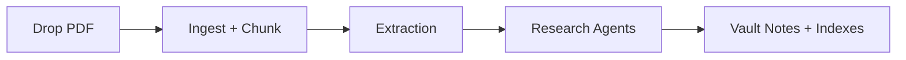

# User Guide

## 1) Who this is for

Use this guide if you want to run Information Lab and consume the generated knowledge outputs without modifying internal code.

## 2) Prerequisites

- Linux host (Raspberry Pi or laptop/server)
- Rust toolchain installed
- Valid Google AI Studio API key
- Writable watch/vault directory

## 3) Minimal setup

1. Configure environment variables:
   - `GOOGLE_API_KEY`
   - `WATCH_DIR`
   - `VAULT_DIR`
   - Optional model overrides: `LIGHT_MODEL`, `HEAVY_MODEL`
2. Start the service:
   - `cargo run`
3. Drop PDFs into `WATCH_DIR`.

## 4) What happens after upload

## 5) Understanding output folders

- `Index.md`: root index of sources and topics.
- `Sources/*.md`: per-source indexes.
- `Topics/*.md`: cross-source topic indexes.
- `Generated/`: agent outputs.
  - `_Syntheses`
  - `_Bridges`
  - `_Theorems`
  - `_Derivations`
  - `_Reports`
- `Formulas.md`: harvested/salvaged formula index.

## 6) Common troubleshooting

### No notes appear

- Check service logs.
- Ensure `WATCH_DIR == VAULT_DIR` if using a single shared path.
- Confirm API key is valid and rate budget is not exhausted.

### Slow output

- This is normal under free-tier RPM limits.
- Heavy-tier agents are intentionally throttled.

### Missing formulas

- Formula salvage depends on math-density thresholds and chunk quality.
- Highly image-based PDFs may still lose detail.

## 7) Operational tips

- Upload smaller batches for faster first-pass results.
- Keep source filenames descriptive.
- Review `_Reports` daily for synthesized progress.
